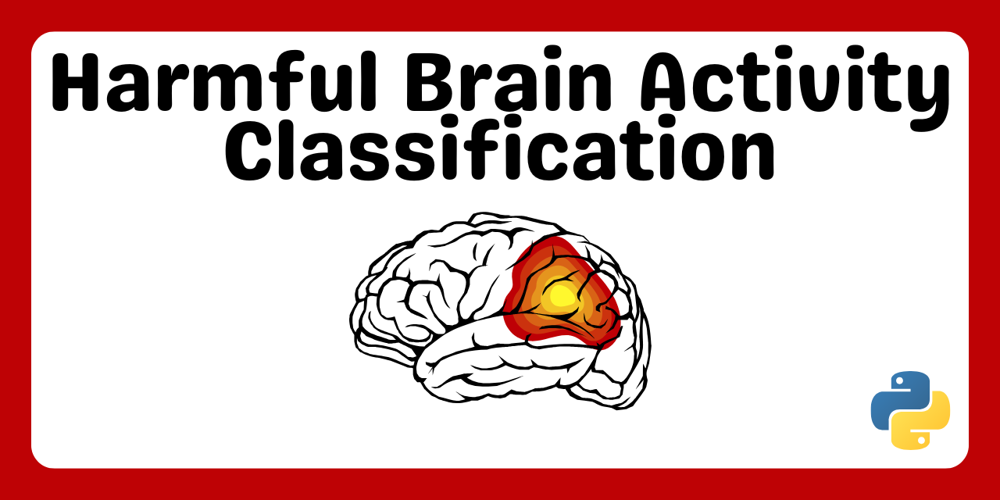
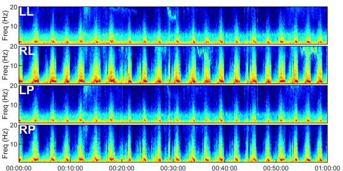
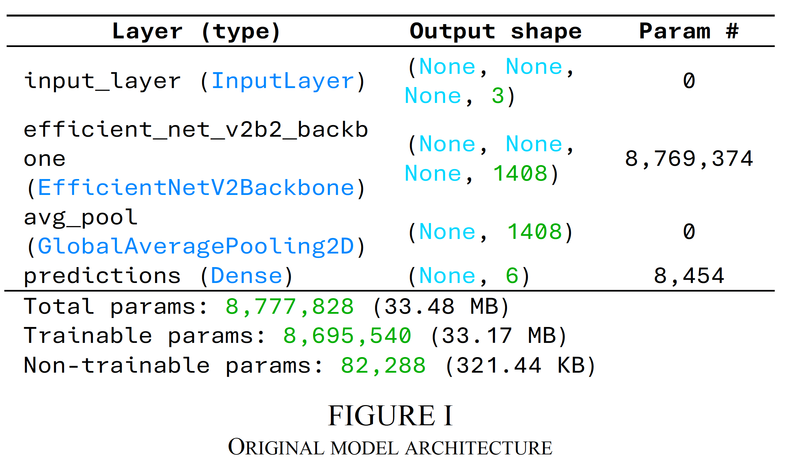
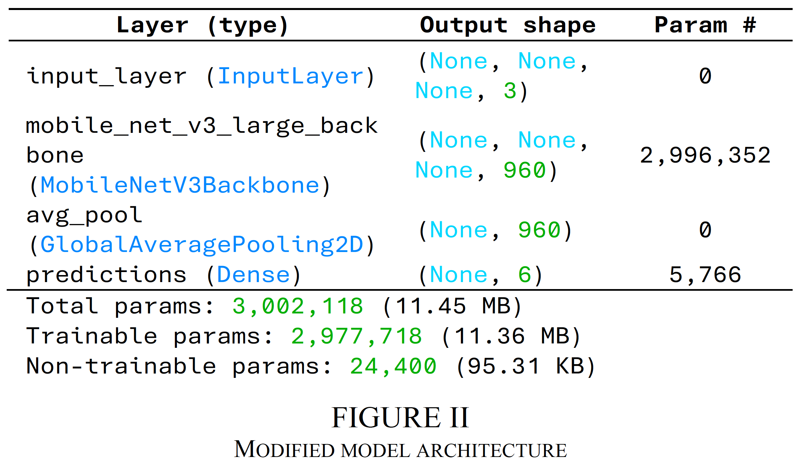
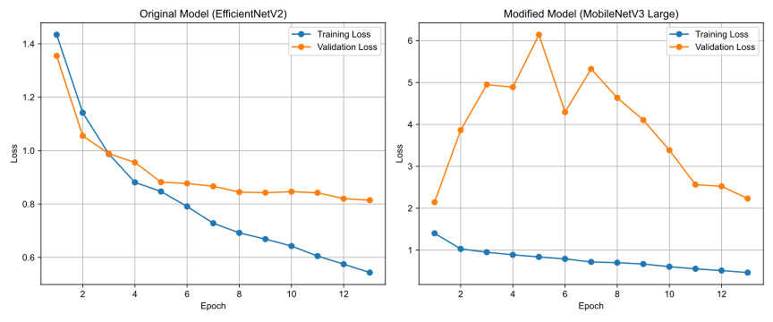

# Harmful Brain Activity Classification with MobileNetV3 using KerasCV

## Table of Contents
- [Harmful Brain Activity Classification with MobileNetV3 using KerasCV](#harmful-brain-activity-classification-with-mobilenetv3-using-kerascv)
  - [Table of Contents](#table-of-contents)
  - [Project Overview](#project-overview)
  - [Abstract](#abstract)
  - [Problem Definition](#problem-definition)
  - [Methodology](#methodology)
    - [Data Preprocessing](#data-preprocessing)
    - [Model Architecture](#model-architecture)
    - [Training Process](#training-process)
    - [Evaluation](#evaluation)
  - [Changes to Original Architecture](#changes-to-original-architecture)
  - [Results](#results)
  - [Lessons Learned](#lessons-learned)
  - [Conclusion](#conclusion)
  - [Project Structure](#project-structure)
  - [References](#references)

## Project Overview

This project is part of the Kaggle competition [HMS - Harmful Brain Activity Classification](https://www.kaggle.com/competitions/hms-harmful-brain-activity-classification), which aims to automate the analysis of electroencephalography (EEG) signals to detect seizures and harmful brain activity in critically ill patients. The competition is hosted by the Sunstella Foundation and seeks to enhance EEG pattern classification accuracy, crucial for neurocritical care and drug development. 

<p align="center">
  
</p>

## Abstract

The current manual EEG analysis is time-consuming and prone to errors. Participants are tasked with developing models to classify EEG patterns, including seizures and various discharges. Our study focuses on the detection and classification of EEG patterns associated with seizures and related conditions. We adapted the KerasCV starter notebook, originally employing the EfficientNetV2 architecture, and made a significant modification by substituting the model with MobileNetV3. Our experiments aimed to explore the comparative performance of the original and modified model architectures, with a particular emphasis on model generalization and overfitting.

## Problem Definition

The competition addresses the pressing need for automating the detection and classification of seizures and other harmful brain activities in critically ill patients. The primary objective is to develop machine learning models that can accurately classify EEG segments into specific patterns, including seizures, generalized periodic discharges, lateralized periodic discharges, and other relevant categories.

## Methodology

### Data Preprocessing

1. **Convert .parquet to .npy**: The original spectrogram data is stored in .parquet files and converted to .npy format for easier data loading and processing.
2. **Data Loading**: The DataLoader reads the preprocessed .npy spectrogram files and extracts labeled subsamples using specified offset values.
3. **Data Augmentation**: Techniques such as MixUp, frequency masking, and time masking are applied to enhance the model's ability to generalize.
4. **Data Split**: The data is divided into training and validation sets using a Stratified Group K-Fold cross-validation strategy.
5. **Build Train & Valid Dataset**: The datasets are constructed using the DataLoader, specifying paths, offsets, class labels, batch size, and other parameters.

### Model Architecture

The original model architecture utilized EfficientNetV2 B2, a convolutional neural network (CNN) model from KerasCV's collection of pretrained models. We replaced this with MobileNetV3 Large to explore its performance characteristics.
<p align="center">
  
</p>

### Training Process

Training was performed over 13 epochs with a batch size of 64 samples, using a cosine learning rate scheduler.

### Evaluation

The evaluation metric is KL Divergence, defined as:
$$D_{KL}(P || Q) = \sum_i P(i) \log \frac{P(i)}{Q(i)}$$

Where $P$ is the true distribution and $Q$ is the predicted distribution. We used it directly as our loss function, removing the need of a third-party metric like Accuracy to evaluate our model. Therefore, valid loss can stand alone as an indicator for our evaluation. We used the implementation for KL Divergence loss in Keras: `keras.losses.KLDivergence()`

## Changes to Original Architecture

We opted for MobileNetV3 instead of EfficientNetV2, leading to a total of 3,002,118 parameters, with 2,977,718 trainable parameters.

<p align="center">
  
</p>

## Results

Both models exhibit a decrease in training and validation loss over epochs. However, the MobileNetV3 Large model demonstrates a slightly higher validation loss, suggesting slightly inferior performance in terms of generalization.

<p align="center">
  
</p>

## Lessons Learned

1. **Model Selection and Architecture**: The choice of model architecture plays a pivotal role in performance.
2. **Generalization and Overfitting**: Robust regularization strategies and hyperparameter tuning are crucial to prevent overfitting.

## Conclusion

Our study contributes valuable insights into the development and optimization of deep learning models for EEG-based harmful brain activity classification. Further investigations into alternative model architectures, regularization techniques, and hyperparameter configurations are warranted.

## Project Structure
```
harmful_brain_activity_classification/
├── src/
│   ├── __init__.py
│   ├── config.py
│   ├── data.py
│   ├── augmentations.py
│   ├── model.py
│   ├── train.py
│   ├── inference.py
│   ├── utils.py
├── README.md
├── requirements.txt
```

## References

1. Kaggle, HMS - Harmful Brain Activity Classification. [Kaggle Competition](https://www.kaggle.com/competitions/hms-harmful-brain-activity-classification)
2. Wood, L., et al., KerasCV. [KerasCV GitHub](https://github.com/keras-team/keras-cv)
